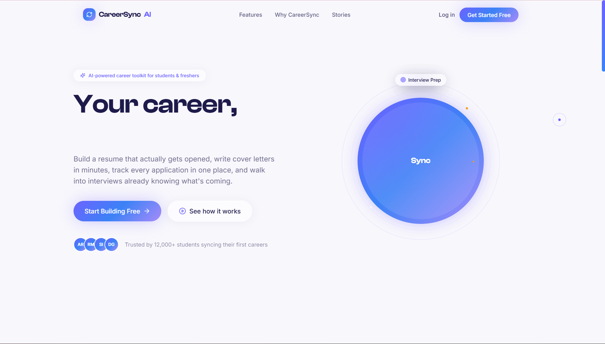

<div align="center">

<!-- ╔══════════════════════════════════════════════════════════════╗ -->
<!--                   ANIMATED WAVE HEADER                         -->
<!-- ╚══════════════════════════════════════════════════════════════╝ -->


<!-- ╔══════════════════════════════════════════════════════════════╗ -->
<!--                  ANIMATED TYPING TAGLINE                       -->
<!-- ╚══════════════════════════════════════════════════════════════╝ -->


<br/>

<!-- ╔══════════════════════════════════════════════════════════════╗ -->
<!--                      CTA BUTTONS                               -->
<!-- ╚══════════════════════════════════════════════════════════════╝ -->

[](https://careersync-ai.netlify.app/)
[](https://aryan-sengar-portfolio-v2.netlify.app/)

<br/>

<!-- ╔══════════════════════════════════════════════════════════════╗ -->
<!--               ANIMATED SKILL / TECH ICON BADGES                -->
<!-- ╚══════════════════════════════════════════════════════════════╝ -->


<br/><br/>


</div>

<br/>

<!-- ━━━━━━━━━━━━━━━━━━━━━━━━━━━━ WAVE DIVIDER ━━━━━━━━━━━━━━━━━━━━━━━━━━━━ -->


<br/>

<!-- ╔══════════════════════════════════════════════════════════════╗ -->
<!--                      SITE PREVIEW                              -->
<!-- ╚══════════════════════════════════════════════════════════════╝ -->

<div align="center">

[](https://careersync-ai.netlify.app/)

*Click the badge above to visit the live site ↑*

</div>

<br/>

<!-- ━━━━━━━━━━━━━━━━━━━━━━━━━━━━ WAVE DIVIDER ━━━━━━━━━━━━━━━━━━━━━━━━━━━━ -->


<br/>

<!-- ╔══════════════════════════════════════════════════════════════╗ -->
<!--                     ABOUT THE PROJECT                          -->
<!-- ╚══════════════════════════════════════════════════════════════╝ -->

## 🔄 About The Project

**CareerSync AI** is a full-featured, production-quality career platform built with **React**, **Vite**, and **Tailwind CSS** — designed for students and freshers who need more than a resume template and a prayer.

It bundles **four tools into one account**: a resume builder with a live ATS-readiness gauge, a cover letter generator that pulls real specifics out of your resume instead of writing generic filler, a drag-and-drop job application tracker, and an interview prep bank organized by topic *and* by company.

> 🟣 Built as an end-to-end product design + full-stack exercise — premium light theme, glassmorphism, and a signature animated "Sync Orb" that ties the brand name back into the UI itself: four product pillars orbiting a central hub, always in sync.

<br/>

<div align="center">

| 🎨 Design | ⚡ Animations | 📄 Resume Builder | 💼 Job Tracker |
|:---:|:---:|:---:|:---:|
| Glassmorphism, floating gradients | GSAP entrances + Framer Motion | Live ATS score, PDF export | Native drag-and-drop Kanban |

</div>

<br/>

<!-- ━━━━━━━━━━━━━━━━━━━━━━━━━━━━ WAVE DIVIDER ━━━━━━━━━━━━━━━━━━━━━━━━━━━━ -->


<br/>

<!-- ╔══════════════════════════════════════════════════════════════╗ -->
<!--                        FEATURES                                -->
<!-- ╚══════════════════════════════════════════════════════════════╝ -->

## ✨ Features

<br/>

| 🎨 UI & Design | ⚙️ Functionality | 📱 UX & Responsiveness |
|:---|:---|:---|
| Premium light theme — indigo/blue/purple/amber palette | Step-by-step resume builder (Personal → Education → Skills → Experience → Projects) | Fully responsive — desktop, tablet, mobile |
| **Clash Display** + **Inter** + **DM Mono** typography | Live ATS-readiness arc gauge, recalculated as you type | Collapsible sidebar → slide-over drawer on mobile |
| Custom dot + trailing ring cursor, amber-tinted on hover | One-click PDF export (jsPDF + html2canvas, multi-page safe) | Magnetic buttons that pull toward the cursor |
| Signature "Sync Orb" — cursor-reactive, orbiting feature chips | Cover letter generator pulling real resume specifics into the draft | GSAP ScrollTrigger stagger reveals on scroll |
| Glassmorphism panels with soft shadows & hairline accents | Kanban job tracker — Applied / Interviewing / Offer / Rejected | Framer Motion page transitions between routes |
| Dual-row marquee testimonials (pure CSS, no library) | Native HTML5 drag-and-drop between status columns | Search & filter on job tracker and interview prep |
| Hand-built SVG donut + funnel + line charts (no chart lib) | Interview prep: technical accordion, HR flip-cards, company-wise tabs | Firebase Auth with automatic local Demo Mode fallback |
| Animated stat counters, gradient hero headline (GSAP stagger) | Dashboard analytics: weekly activity, pipeline funnel, avg. ATS score | localStorage persistence, namespaced per user |

<br/>

### 📌 Pages & Sections

```
Landing  ·  Login / Signup  ·  Dashboard  ·  Resume Builder  ·  Cover Letter Generator  ·  Job Tracker  ·  Interview Prep
```

<br/>

<!-- ━━━━━━━━━━━━━━━━━━━━━━━━━━━━ WAVE DIVIDER ━━━━━━━━━━━━━━━━━━━━━━━━━━━━ -->


<br/>

<!-- ╔══════════════════════════════════════════════════════════════╗ -->
<!--                        TECH STACK                              -->
<!-- ╚══════════════════════════════════════════════════════════════╝ -->

## 🛠️ Tech Stack

<br/>

<div align="center">


<br/><br/>

| Layer | Technology | Purpose |
|:---:|:---|:---|
| ⚛️ **Framework** | [React 18](https://react.dev/) + [Vite 5](https://vitejs.dev/) | Component architecture, instant HMR, production bundling |
| 🎨 **Styling** | [Tailwind CSS v3](https://tailwindcss.com/) | Utility-first design system with custom brand tokens |
| 🧭 **Routing** | [React Router 6](https://reactrouter.com/) | Client-side routing, protected dashboard routes |
| 🎞️ **Animation** | [Framer Motion](https://www.framer.com/motion/) | Component interactions, page transitions, layout animation |
| 🌀 **Animation** | [GSAP](https://gsap.com/) + ScrollTrigger | Hero entrance timeline, scroll-triggered stagger reveals |
| 🔐 **Backend** | [Firebase Auth](https://firebase.google.com/) | Email/password authentication, with a Demo Mode fallback |
| 💾 **Persistence** | `localStorage` | Resumes, cover letters & applications — namespaced per user |
| 📄 **PDF Export** | [jsPDF](https://github.com/parallax/jsPDF) + [html2canvas](https://html2canvas.hertzen.com/) | Resume & cover letter export, paginated for A4 |
| 🎯 **Icons** | [lucide-react](https://lucide.dev/) | Consistent line-icon set across the app |
| 🔤 **Fonts** | [Fontshare](https://www.fontshare.com/) + [Google Fonts](https://fonts.google.com/) — Clash Display, Inter, DM Mono | Brand typography system |
| 🚀 **Deployment** | [Netlify](https://www.netlify.com/) | Live hosting & continuous deployment |

</div>

<br/>

<!-- ━━━━━━━━━━━━━━━━━━━━━━━━━━━━ WAVE DIVIDER ━━━━━━━━━━━━━━━━━━━━━━━━━━━━ -->


<br/>

<!-- ╔══════════════════════════════════════════════════════════════╗ -->
<!--                     PROJECT STRUCTURE                          -->
<!-- ╚══════════════════════════════════════════════════════════════╝ -->

## 📁 Project Structure

```
careersync-ai/
│
├── 📄 index.html                    ← Entry HTML + SEO meta + font links
├── 📦 package.json                  ← Dependencies & scripts
├── ⚙️  vite.config.js               ← Vite config + manual vendor chunking
├── 🎨 tailwind.config.js            ← Brand colors, fonts, shadows, keyframes
├── 🌐 netlify.toml                  ← Build command, publish dir, SPA redirect
├── 🔑 .env.example                  ← Firebase credential template
│
├── 📂 public/
│   ├── 🖼️  favicon.svg              ← Sync-arrows brand mark
│   ├── 🔁 _redirects                ← Netlify SPA fallback (belt-and-suspenders)
│   └── 🤖 robots.txt
│
└── 📂 src/
    ├── 🚀 main.jsx                  ← React entry point, providers
    ├── 🧠 App.jsx                   ← Routing, cursor, page transitions
    ├── 🎨 index.css                 ← Global styles, glass utilities, cursor
    │
    ├── 📂 firebase/
    │   └── ⚙️  config.js             ← Firebase bootstrap + demo-mode detection
    │
    ├── 📂 context/
    │   ├── 🔐 AuthContext.jsx       ← Firebase auth + local Demo Mode
    │   └── 💾 DataContext.jsx       ← Resumes, cover letters, applications
    │
    ├── 📂 hooks/
    │   └── 🌀 useGsapStagger.js     ← Reusable ScrollTrigger stagger hook
    │
    ├── 📂 data/
    │   ├── 💬 testimonials.js
    │   └── 🎯 interviewQuestions.js ← Technical, HR & company-wise banks
    │
    ├── 📂 utils/
    │   ├── 📋 resumeModel.js        ← Resume schema + ATS scoring heuristic
    │   ├── 🖨️  pdfExport.js          ← html2canvas + jsPDF, multi-page
    │   └── ✉️  coverLetterGenerator.js
    │
    ├── 📂 components/
    │   ├── 📂 layout/               ← Navbar, Footer, AppShell (sidebar)
    │   ├── 📂 ui/                   ← CustomCursor, MagneticButton, SyncOrb,
    │   │                              GlassCard, AnimatedCounter, ScrollReveal
    │   ├── 📂 resume/                ← Step forms, ResumePreview, AtsScoreMeter
    │   ├── 📂 jobtracker/            ← ApplicationCard, ApplicationModal, StatusDonut
    │   ├── 📂 interview/             ← AccordionQuestion, FlipCard
    │   └── 📂 charts/                ← ActivityChart, FunnelBar (hand-built SVG)
    │
    └── 📂 pages/
        ├── 📂 Landing/               ← Hero, Features, Stats, Testimonials, CTA
        ├── 📂 Auth/                  ← Login, Signup
        ├── 📂 Dashboard/
        ├── 📂 ResumeBuilder/
        ├── 📂 CoverLetter/
        ├── 📂 JobTracker/
        └── 📂 InterviewPrep/
```

<br/>

<!-- ━━━━━━━━━━━━━━━━━━━━━━━━━━━━ WAVE DIVIDER ━━━━━━━━━━━━━━━━━━━━━━━━━━━━ -->


<br/>

<!-- ╔══════════════════════════════════════════════════════════════╗ -->
<!--                      GETTING STARTED                           -->
<!-- ╚══════════════════════════════════════════════════════════════╝ -->

## 🚀 Getting Started

**1. Clone the repository**

```bash
git clone https://github.com/aryansengar007/careersync-ai.git
```

**2. Navigate into the project folder**

```bash
cd careersync-ai
```

**3. Install dependencies**

```bash
npm install
```

**4. (Optional) Connect Firebase**

```bash
cp .env.example .env.local
# then fill in your Firebase project keys
```

> Skip this step entirely and the app runs on **Demo Mode** — accounts and data are stored locally via `localStorage`, so every feature works immediately without a live backend.

**5. Start the development server**

```bash
npm run dev
```

**6. Build for production**

```bash
npm run build
npm run preview
```

> ✅ Runs on `http://localhost:5173` by default. Requires Node.js 18+.

<br/>

<!-- ━━━━━━━━━━━━━━━━━━━━━━━━━━━━ WAVE DIVIDER ━━━━━━━━━━━━━━━━━━━━━━━━━━━━ -->


<br/>

<!-- ╔══════════════════════════════════════════════════════════════╗ -->
<!--                    DEPLOYING ON NETLIFY                        -->
<!-- ╚══════════════════════════════════════════════════════════════╝ -->

## 🌐 Deploying on Netlify

The repo ships ready to deploy as-is — `netlify.toml` already sets the build command, publish directory, and the SPA redirect rule that client-side routing needs:

| Setting | Value |
|:---|:---|
| Build command | `npm run build` |
| Publish directory | `dist` |
| Node version | `20` (pinned via `.nvmrc` + `netlify.toml`) |

1. Push this repo to GitHub.
2. On [Netlify](https://app.netlify.com/), **Add new site → Import an existing project**, and pick the repo. Netlify will auto-detect the settings above from `netlify.toml`.
3. *(Optional)* Add your Firebase keys under **Site settings → Environment variables** (same names as `.env.example`, e.g. `VITE_FIREBASE_API_KEY`). Without them, the live site simply runs in Demo Mode — fully functional, no backend required.
4. Deploy. Every subsequent push to your main branch redeploys automatically.

> 🧩 **Why this matters:** without the redirect rule in `netlify.toml` / `public/_redirects`, refreshing the page on any route other than `/` (e.g. `/dashboard`) would return a Netlify 404 — Netlify doesn't know about React Router's client-side paths unless told to fall back to `index.html`. Both files are already in the repo, so this is handled.

<br/>

<!-- ━━━━━━━━━━━━━━━━━━━━━━━━━━━━ WAVE DIVIDER ━━━━━━━━━━━━━━━━━━━━━━━━━━━━ -->


<br/>

<!-- ╔══════════════════════════════════════════════════════════════╗ -->
<!--                   DESIGN CHALLENGES                            -->
<!-- ╚══════════════════════════════════════════════════════════════╝ -->

## 🧩 Design Challenges & What I Learned

A few things took real iteration to get right while building this:

| 🐛 Challenge | ✅ Resolution |
|:---|:---|
| Tailwind silently dropping classes built from JS template strings (`` `bg-sync-${accent}/10` ``) | Tailwind's content scanner can't see computed strings at build time — replaced every dynamic class with an explicit lookup map of full class names |
| Rollup warning: `firebase/auth` imported both statically and dynamically | Consolidated `AuthContext` to static imports at the top of the file, since the module was already being pulled in by `firebase/config.js` anyway |
| html2canvas + jsPDF only capturing the first page of a long resume | Added a pagination loop that slices the rendered canvas across multiple A4 pages instead of a single `addImage` call |
| Orbiting feature chips around the Sync Orb spinning out of orientation | Parent ring rotates via `animate-spin-slow`; each chip counter-rotates on its own keyframe at the same duration/delay so the icon and label stay upright |
| Stacking 4 segments into one SVG donut without overlapping arcs | Tracked a running `cumulative` offset per segment and derived each `strokeDashoffset` from it, rather than hardcoding angles |
| Wanted premium charts without pulling in a charting library | Hand-built the dashboard's line/area chart and funnel bars directly in SVG, with `stroke-dashoffset` and `pathLength` animations for the draw-in effect |
| Two testimonial rows scrolling in opposite directions without jank | Pure CSS `translateX` keyframes on duplicated arrays (`[...items, ...items]`), paused on hover via `hover:[animation-play-state:paused]` |
| React Router routes 404'ing on Netlify after deploy | Added `netlify.toml` with an explicit `[[redirects]]` rule (`/* → /index.html`) plus a `public/_redirects` fallback, since Netlify has no idea client-side routes exist otherwise |
| Renaming the project from CareerForge to CareerSync mid-build | Swapped the brand mark from a flame to a sync icon, renamed every `forge-` design token to `sync-`, and rewrote copy that leaned on the old "forged" metaphor so nothing reads as a leftover |

> 💡 **Key takeaway:** most of the "premium feel" in this build came from refusing generic defaults — a progress bar became an arc gauge, a card grid got an icon glow and an accent edge, a stat row became an animated counter. None of it is complicated; it's just not the first thing Tailwind gives you out of the box.

<br/>

<!-- ━━━━━━━━━━━━━━━━━━━━━━━━━━━━ WAVE DIVIDER ━━━━━━━━━━━━━━━━━━━━━━━━━━━━ -->


<br/>

<!-- ╔══════════════════════════════════════════════════════════════╗ -->
<!--                    ACKNOWLEDGEMENTS                            -->
<!-- ╚══════════════════════════════════════════════════════════════╝ -->

## 🙌 Acknowledgements

- 🎞️ Animation direction inspired by [ReactBits](https://reactbits.dev/), [Dribbble](https://dribbble.com/), [60fps.design](https://60fps.design/), [Uiverse](https://uiverse.io/), and [v0.dev](https://v0.dev/)
- 🎯 Icons by [lucide-react](https://lucide.dev/)
- 🔤 Typography via [Fontshare](https://www.fontshare.com/) (Clash Display) and [Google Fonts](https://fonts.google.com/) (Inter, DM Mono)
- 🔐 Authentication via [Firebase](https://firebase.google.com/)
- 📄 PDF export via [jsPDF](https://github.com/parallax/jsPDF) & [html2canvas](https://html2canvas.hertzen.com/)
- 🚀 Hosting via [Netlify](https://www.netlify.com/)

<br/>

<!-- ╔══════════════════════════════════════════════════════════════╗ -->
<!--                     AUTHOR & CONNECT                           -->
<!-- ╚══════════════════════════════════════════════════════════════╝ -->

## 👨‍💻 Author

<div align="center">

### Aryan Sengar

🎓 **B.Tech CSE (AI & ML)** &nbsp;|&nbsp; 🌍 Gurugram, India &nbsp;|&nbsp; Frontend Developer & UI Enthusiast

<br/>

[](https://www.linkedin.com/in/aryan-sengar-786b96290/)
[](https://github.com/aryansengar007)
[](https://aryan-sengar-portfolio-v2.netlify.app/)
[](https://leetcode.com/u/aryan_sengar007/)

</div>

<br/>

<!-- ╔══════════════════════════════════════════════════════════════╗ -->
<!--                   ANIMATED WAVE FOOTER                         -->
<!-- ╚══════════════════════════════════════════════════════════════╝ -->


<div align="center">

© 2026 **Aryan Sengar** — All Rights Reserved. Unauthorized copying is strictly prohibited.

<br/>

*If you found this project helpful or inspiring, consider leaving a* ⭐ *— it means a lot!*

</div>
